# 🔧 Technical Architecture Documentation

## 🏗️ System Architecture Deep Dive

### Core Components Architecture

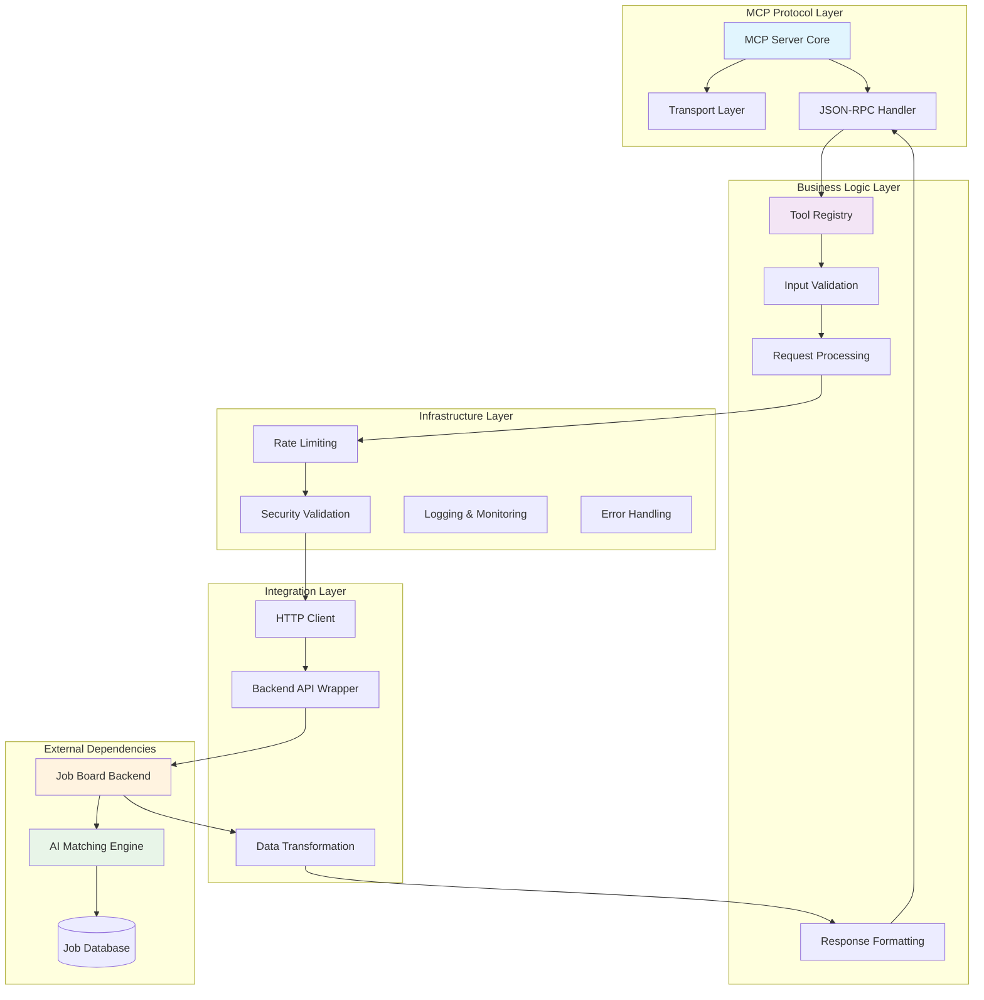

## 🔄 Request Processing Pipeline

### Full Request Lifecycle

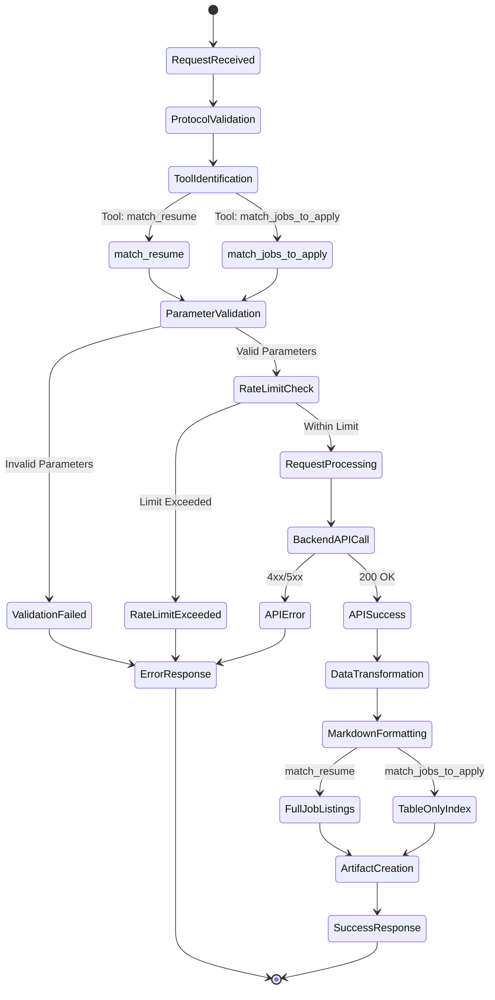

## 🛠️ Tool Implementation Details

### Tool Schema Architecture

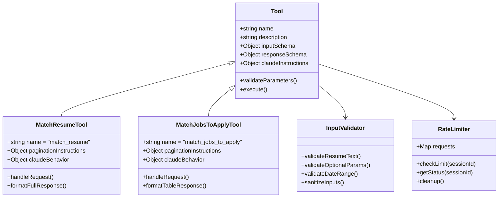

### Parameter Validation Flow

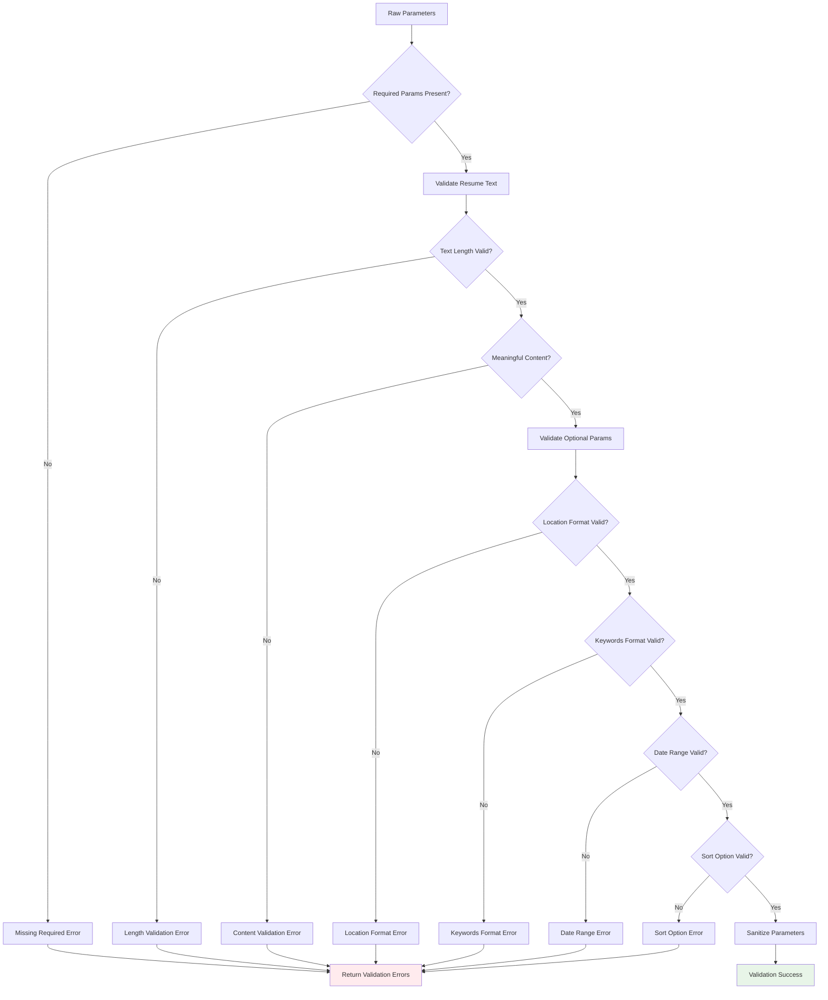

## 🎯 Backend Integration Architecture

### API Communication Pattern

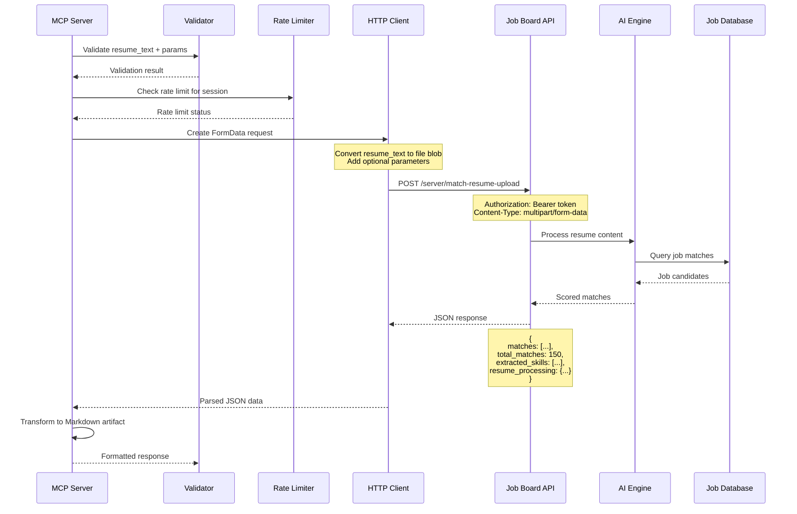

### Data Transformation Pipeline

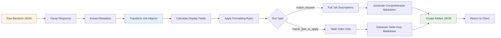

## 🌐 Deployment Architecture

### Multi-Environment Deployment

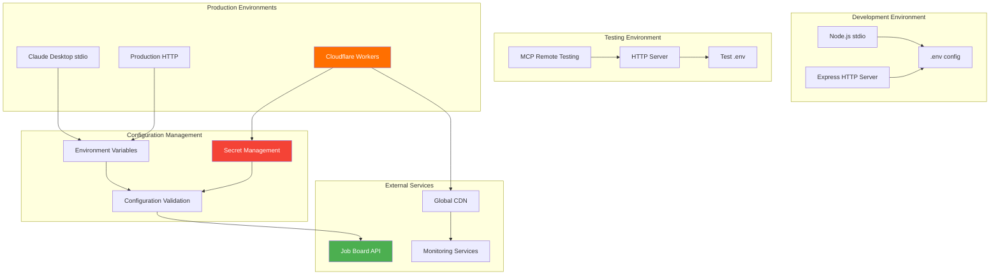

## 🔒 Security Architecture

### Security Layers

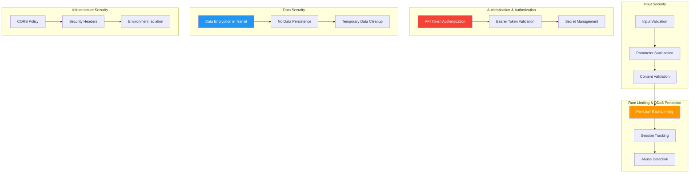

## 📊 Performance Architecture

### Performance Optimization Strategy

```mermaid
flowchart TB
    subgraph "Request Optimization"
        REQ_CACHE[Request Caching]
        PARAM_OPT[Parameter Optimization]
        BATCH_PROC[Batch Processing]
    end
    
    subgraph "Response Optimization"
        RESP_COMPRESS[Response Compression]
        MARKDOWN_OPT[Markdown Optimization]
        ARTIFACT_CACHE[Artifact Caching]
    end
    
    subgraph "Backend Optimization"
        CONN_POOL[Connection Pooling]
        TIMEOUT_MGMT[Timeout Management]
        RETRY_LOGIC[Retry Logic]
    end
    
    subgraph "Infrastructure Optimization"
        EDGE_CACHE[Edge Caching]
        CDN_DIST[CDN Distribution]
        REGIONAL_DEPLOY[Regional Deployment]
    end
    
    subgraph "Monitoring & Metrics"
        PERF_METRICS[Performance Metrics]
        RESPONSE_TIME[Response Time Tracking]
        ERROR_RATES[Error Rate Monitoring]
    end
    
    REQ_CACHE --> PARAM_OPT
    PARAM_OPT --> BATCH_PROC
    
    RESP_COMPRESS --> MARKDOWN_OPT
    MARKDOWN_OPT --> ARTIFACT_CACHE
    
    CONN_POOL --> TIMEOUT_MGMT
    TIMEOUT_MGMT --> RETRY_LOGIC
    
    EDGE_CACHE --> CDN_DIST
    CDN_DIST --> REGIONAL_DEPLOY
    
    PERF_METRICS --> RESPONSE_TIME
    RESPONSE_TIME --> ERROR_RATES
    
    style EDGE_CACHE fill:#4caf50,color:#fff
    style RESP_COMPRESS fill:#2196f3,color:#fff
    style PERF_METRICS fill:#ff9800,color:#fff
```

## 🧩 Component Integration Matrix

### Inter-Component Dependencies

| Component | Dependencies | Provides | Consumers |
|-----------|-------------|----------|-----------|
| **MCP Server Core** | Transport, Protocol | Tool Registry, Request Routing | Claude Desktop, HTTP Clients |
| **Tool Registry** | Validation Schemas | Tool Definitions, Execution | MCP Server Core |
| **Input Validator** | Validation Rules | Parameter Validation | Tool Handlers |
| **Rate Limiter** | Session Storage | Rate Limit Enforcement | Tool Handlers |
| **Markdown Formatter** | Template Engine | Artifact Generation | Tool Handlers |
| **HTTP Client** | Fetch API, FormData | Backend Communication | Tool Handlers |
| **Security Validator** | Environment Config | Security Validation | Deployment Process |

### Data Flow Integration

```mermaid
graph LR
    subgraph "Input Processing"
        A[Raw Request] --> B[Protocol Parser]
        B --> C[Tool Router]
        C --> D[Parameter Validator]
    end
    
    subgraph "Business Logic"
        D --> E[Rate Limiter]
        E --> F[Tool Handler]
        F --> G[Backend Client]
    end
    
    subgraph "Output Processing"
        G --> H[Response Parser]
        H --> I[Data Transformer]
        I --> J[Markdown Formatter]
        J --> K[Artifact Builder]
    end
    
    subgraph "Response Delivery"
        K --> L[Protocol Encoder]
        L --> M[Transport Layer]
        M --> N[Client Response]
    end
    
    style A fill:#ffcdd2
    style F fill:#c8e6c9
    style K fill:#bbdefb
    style N fill:#d1c4e9
```

## 🔄 Scalability Considerations

### Horizontal Scaling Architecture

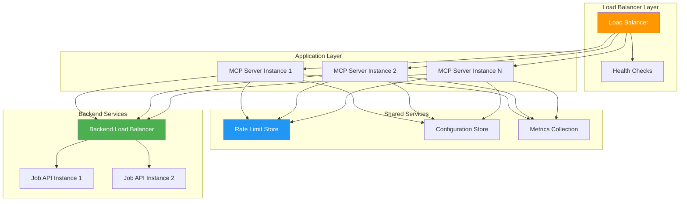

This technical architecture documentation provides a comprehensive deep-dive into the system's design, implementation patterns, and deployment strategies. The diagrams illustrate the complex interactions between components and help developers understand the system's behavior at scale.