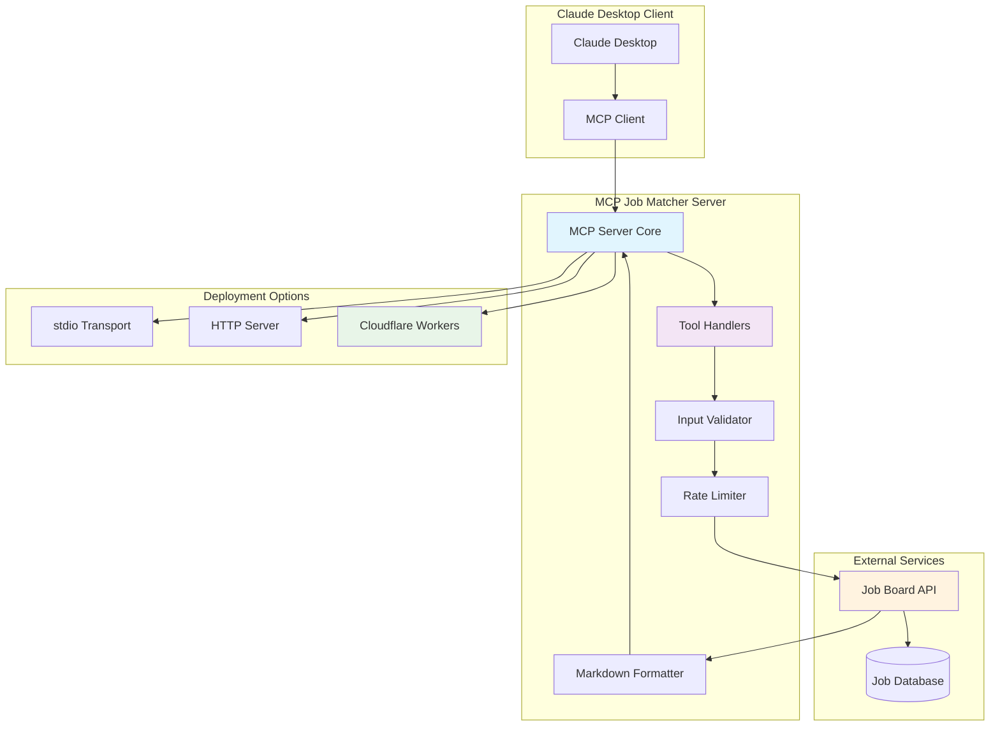
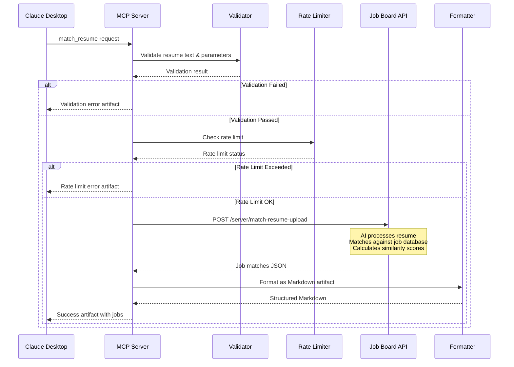
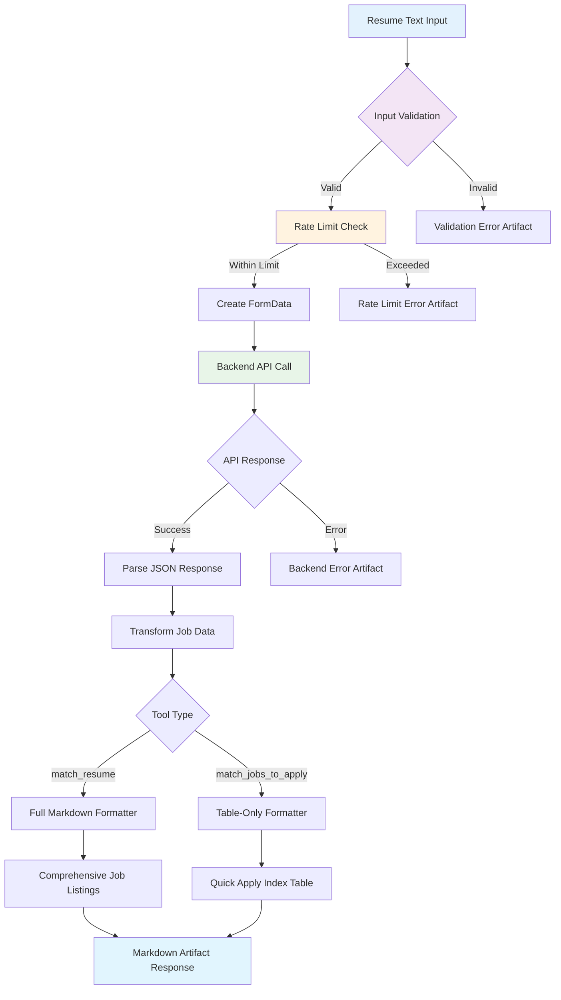

# 🎯 MCP Job Matcher Server

[](https://opensource.org/licenses/MIT)
[](https://nodejs.org/)
[](https://modelcontextprotocol.io/)
[](https://workers.cloudflare.com/)

A sophisticated **Model Context Protocol (MCP) Server** that integrates Claude Desktop with an intelligent job matching backend. This server enables seamless resume-based job matching with advanced AI-powered features, multiple deployment options, and enterprise-grade security.

## 🌟 Key Features

### 🔧 Core Functionality
- **🎯 AI-Powered Job Matching**: Advanced similarity scoring algorithm with 70%+ match accuracy
- **📄 Multiple Resume Formats**: Support for PDF, DOCX, DOC, and TXT files
- **🔍 Smart Filtering**: Location-based, date range, and skill-based job filtering
- **📊 Rich Markdown Artifacts**: Beautiful, interactive job listings with detailed metadata
- **⚡ Dual Tool Interface**: Full job descriptions or quick application tables

### 🛡️ Enterprise Features
- **🔒 Rate Limiting**: Configurable per-user rate limiting (10 requests/minute default)
- **✅ Input Validation**: Comprehensive resume text and parameter validation
- **🚨 Error Handling**: Graceful error handling with user-friendly Markdown responses
- **📈 Performance Monitoring**: Built-in logging and performance metrics

### 🚀 Deployment Options
- **💻 Local Development**: Node.js with stdio transport for Claude Desktop
- **🌐 HTTP Server**: Express.js server with RESTful API endpoints
- **☁️ Cloudflare Workers**: Serverless deployment with global edge distribution
- **🔌 MCP Remote**: Compatible with mcp-remote for HTTP-based MCP connections

## 🏗️ Architecture Overview



## 🔄 Request Flow Diagram



## 📁 Project Structure

```
mcp_server/
├── 📄 index.js                 # Main MCP Server (stdio transport)
├── 🌐 start-http.js           # HTTP Server wrapper
├── ☁️ src/worker.js           # Cloudflare Workers entry point
├── 🔧 tools.js                # Tool definitions & schemas
├── ✅ validator.js            # Input validation logic
├── ⏱️ rateLimiter.js          # Rate limiting implementation
├── 📝 markdownFormatter.js    # Markdown artifact formatter
├── 🔒 validate-security.js    # Security configuration validator
├── 📦 package.json            # Dependencies & scripts
├── ⚙️ wrangler.toml          # Cloudflare Workers config
├── 🔐 .env                    # Environment variables
└── 📚 README.md              # This documentation
```

## 🛠️ Tool Interface

### 🎯 `match_resume` Tool

**Purpose**: Find matching job opportunities with full job descriptions
**Response**: Comprehensive Markdown artifact with detailed job listings

```javascript
{
  "name": "match_resume",
  "description": "Find matching job opportunities with full descriptions",
  "inputSchema": {
    "type": "object",
    "properties": {
      "resume_text": {
        "type": "string",
        "description": "Well-formatted full resume text (500-15,000 characters)",
        "minLength": 500,
        "maxLength": 15000
      },
      "location": {
        "type": "string",
        "description": "Comma-separated city names (optional)",
        "examples": ["San Francisco, Austin", "Remote"]
      },
      "keywords": {
        "type": "string", 
        "description": "Comma-separated skills/technologies (optional)",
        "examples": ["python,django,react", "aws,docker,kubernetes"]
      },
      "start_date": {
        "type": "string",
        "pattern": "^\\d{4}-\\d{2}-\\d{2}$",
        "description": "Start date in YYYY-MM-DD format (optional)"
      },
      "end_date": {
        "type": "string",
        "pattern": "^\\d{4}-\\d{2}-\\d{2}$", 
        "description": "End date in YYYY-MM-DD format (optional)"
      },
      "sort_by": {
        "type": "string",
        "enum": ["similarity", "date"],
        "default": "similarity"
      }
    },
    "required": ["resume_text"]
  }
}
```

### 📋 `match_jobs_to_apply` Tool

**Purpose**: Get job opportunities index table for quick application overview
**Response**: Table-only Markdown artifact optimized for rapid application workflows

```javascript
{
  "name": "match_jobs_to_apply", 
  "description": "Get job opportunities index table for applying",
  "inputSchema": {
    // Same schema as match_resume
  }
}
```

## 🔄 Data Flow Architecture



## 🚀 Quick Start

### Prerequisites
- **Node.js 18+**
- **API Authentication Token** for the job board backend
- **Claude Desktop** (for MCP integration)

### 1. Installation

```bash
# Clone the repository
git clone <repository-url>
cd mcp_server

# Install dependencies
npm install

# Copy environment template
cp .env.example .env
```

### 2. Configuration

Edit `.env` file with your settings:

```bash
# Required: Your API authentication token
API_AUTH_TOKEN=Bearer your_secure_api_token_here

# Optional: Backend configuration (defaults provided)
BACKEND_URL=https://jobboardaggregator-production.up.railway.app
BACKEND_ENDPOINT=/server/match-resume-upload
RATE_LIMIT_PER_MINUTE=10
MAX_FILE_SIZE=15000
TIMEOUT=30000
```

### 3. Security Validation

```bash
# Validate security configuration
npm run validate-security
```

### 4. Choose Your Deployment

#### Option A: Claude Desktop (MCP stdio)
```bash
# Start stdio MCP server
npm start

# Configure in Claude Desktop's config file
{
  "mcpServers": {
    "job-matcher": {
      "command": "node",
      "args": ["path/to/index.js"],
      "cwd": "path/to/mcp_server"
    }
  }
}
```

#### Option B: HTTP Server
```bash
# Start HTTP server
npm run http

# Server available at http://localhost:3000
# Test with: curl http://localhost:3000/health
```

#### Option C: Cloudflare Workers
```bash
# Set your API token as a secret
npx wrangler secret put API_AUTH_TOKEN

# Deploy to Cloudflare Workers
npm run deploy

# Available at: https://mcp-job-matcher.your-subdomain.workers.dev
```

## 🔧 API Endpoints

### MCP Protocol Endpoints

| Method | Endpoint | Description |
|--------|----------|-------------|
| `POST` | `/` | Main MCP JSON-RPC endpoint |
| `GET` | `/` | Server-Sent Events (SSE) transport |

### Enhanced API Endpoints

| Method | Endpoint | Description |
|--------|----------|-------------|
| `GET` | `/health` | Health check and server status |
| `GET` | `/mcp/tools` | List all available tools with metadata |
| `GET` | `/mcp/tools/:name` | Get specific tool schema and documentation |
| `POST` | `/mcp/tools/call` | Execute tool with validation and rate limiting |

## 📊 Response Format

### Success Response Structure

```json
{
  "result": "...markdown_artifact_json...",
  "tool": "match_resume",
  "metadata": {
    "server": "job-matcher-mcp-server",
    "version": "1.0.0",
    "transport": "HTTP",
    "rateLimitRemaining": 9
  },
  "timestamp": "2025-01-15T10:30:00.000Z"
}
```

### Markdown Artifact Structure

```json
{
  "please_render_as_artifact": true,
  "artifact_required": true,
  "artifact_type": "text/markdown",
  "artifact_id": "job-matches-markdown-1642234567890",
  "artifact_title": "Job Match Results - 150 opportunities found",
  "content": "# 🎯 Job Search Results Dashboard\n\n...",
  "metadata": {
    "total_matches": 150,
    "page": 1,
    "has_more": true,
    "source": "MCP Job Matcher Server v1.0.0"
  }
}
```

## 🛡️ Security Features

### 🔒 Environment Security
- **API Token Protection**: Secure token storage in environment variables
- **Secret Validation**: Pre-deployment security configuration validation
- **Source Code Scanning**: Automated detection of hardcoded secrets

### ⚡ Performance Security
- **Rate Limiting**: Configurable per-user request throttling
- **Input Validation**: Comprehensive parameter and resume text validation
- **Resource Limits**: File size and processing time constraints

### 🔐 Deployment Security
- **Environment Isolation**: Separate configurations for development/production
- **Token Rotation**: Support for secure API token updates
- **CORS Protection**: Configurable cross-origin request policies

## 📈 Monitoring & Logging

### Request Metrics
```javascript
// Rate limit status
{
  "requestCount": 3,
  "remaining": 7,
  "resetTime": "2025-01-15T10:35:00.000Z",
  "limit": 10
}

// Processing metrics
{
  "resume_processing": {
    "filename": "resume.txt",
    "parsing_method": "text_extraction",
    "enhancement_used": true,
    "original_length": 2341,
    "enhanced_length": 3456
  }
}
```

### Error Tracking
- **Validation Errors**: Detailed parameter validation feedback
- **Backend Errors**: Comprehensive API error handling with suggested fixes
- **Rate Limit Errors**: User-friendly rate limiting notifications
- **System Errors**: Graceful handling of unexpected server errors

## 🧪 Testing

### Health Check
```bash
curl http://localhost:3000/health
```

### Tool Listing
```bash
curl http://localhost:3000/mcp/tools
```

### Tool Execution
```bash
curl -X POST http://localhost:3000/mcp/tools/call \
  -H "Content-Type: application/json" \
  -d '{
    "name": "match_resume",
    "arguments": {
      "resume_text": "John Doe - Senior Software Engineer..."
    }
  }'
```

### MCP Protocol Test
```bash
# Using mcp-remote for MCP protocol testing
npx mcp-remote http://localhost:3000
```

## 🚀 Deployment Scenarios

### Development Environment
```bash
# Local development with hot reload
npm run dev

# Development HTTP server
npm run http:dev
```

### Production Environment

#### Node.js Production
```bash
# Production stdio server
NODE_ENV=production npm start

# Production HTTP server  
NODE_ENV=production npm run http
```

#### Cloudflare Workers Production
```bash
# Set production secrets
npx wrangler secret put API_AUTH_TOKEN
npx wrangler secret put BACKEND_URL

# Deploy to production
npm run deploy

# Monitor logs
npm run cf:tail
```

## 🔧 Configuration Reference

### Environment Variables

| Variable | Default | Description |
|----------|---------|-------------|
| `API_AUTH_TOKEN` | *(required)* | Bearer token for job board API |
| `BACKEND_URL` | `https://jobboardaggregator-production.up.railway.app` | Job board API base URL |
| `BACKEND_ENDPOINT` | `/server/match-resume-upload` | API endpoint path |
| `RATE_LIMIT_PER_MINUTE` | `10` | Requests per minute per user |
| `MAX_FILE_SIZE` | `15000` | Maximum resume text length (characters) |
| `MIN_FILE_SIZE` | `500` | Minimum resume text length (characters) |
| `TIMEOUT` | `30000` | API request timeout (milliseconds) |
| `PORT` | `3000` | HTTP server port |
| `NODE_ENV` | `production` | Environment mode |
| `LOG_LEVEL` | `info` | Logging verbosity |

### Tool Configuration

#### Resume Text Requirements
- **Minimum Length**: 500 characters
- **Maximum Length**: 15,000 characters  
- **Content Validation**: Must contain meaningful resume content
- **Format**: Plain text with structure preserved

#### Optional Parameters
- **Location**: Comma-separated city names with expansion support
- **Keywords**: Comma-separated skills/technologies
- **Date Range**: YYYY-MM-DD format with validation
- **Sorting**: `similarity` (default) or `date`

## 🤝 Integration Examples

### Claude Desktop Integration

**claude_desktop_config.json**:
```json
{
  "mcpServers": {
    "job-matcher": {
      "command": "node",
      "args": ["C:\\path\\to\\mcp_server\\index.js"],
      "cwd": "C:\\path\\to\\mcp_server",
      "env": {
        "API_AUTH_TOKEN": "Bearer your_token_here"
      }
    }
  }
}
```

### HTTP Client Integration

**JavaScript Client**:
```javascript
const response = await fetch('http://localhost:3000/mcp/tools/call', {
  method: 'POST',
  headers: { 'Content-Type': 'application/json' },
  body: JSON.stringify({
    name: 'match_resume',
    arguments: {
      resume_text: 'John Doe - Senior Software Engineer (8 years)...',
      location: 'San Francisco, Austin'
    }
  })
});

const result = await response.json();
console.log(result.result); // Markdown artifact JSON
```

### Python Client Integration

```python
import requests

response = requests.post('http://localhost:3000/mcp/tools/call', json={
    'name': 'match_resume',
    'arguments': {
        'resume_text': 'John Doe - Senior Software Engineer...',
        'keywords': 'python,django,react'
    }
})

result = response.json()
artifact = json.loads(result['result'])
print(artifact['content'])  # Markdown content
```

## 🐛 Troubleshooting

### Common Issues

#### API Authentication Error
```
Error: Invalid API authentication
```
**Solution**: Verify `API_AUTH_TOKEN` is set correctly with "Bearer " prefix.

#### Rate Limit Exceeded
```
Error: Rate limit exceeded - Too many requests
```
**Solution**: Wait for reset time or increase `RATE_LIMIT_PER_MINUTE` in configuration.

#### Resume Text Too Short
```
Error: Resume text is too short. Minimum 500 characters required
```
**Solution**: Provide complete resume text with full experience details.

#### Connection Timeout
```
Error: Backend API request timeout
```
**Solution**: Check network connectivity or increase `TIMEOUT` value.

### Debug Mode

Enable debug logging:
```bash
LOG_LEVEL=debug npm start
```

View detailed request logs:
```bash
# HTTP server logs
tail -f server.log

# Cloudflare Workers logs
npm run cf:tail
```

## 📚 Advanced Usage

### Custom Rate Limiting
```javascript
// Customize rate limiter
const customRateLimiter = new RateLimiter(20, 60000); // 20 requests per minute
```

### Custom Validation
```javascript
// Add custom validation rules
const customValidation = validateInputs({
  ...args,
  customField: 'value'
});
```

### Custom Markdown Formatting
```javascript
// Extend markdown formatter
const customMarkdown = formatMarkdownResponse(data, {
  template: 'custom',
  showDetailedMetrics: true
});
```

## 🔄 Update & Maintenance

### Updating Dependencies
```bash
# Check for outdated packages
npm outdated

# Update dependencies
npm update

# Audit security vulnerabilities
npm audit
```

### Database Schema Updates
The server automatically adapts to backend API schema changes. Monitor logs for parsing warnings.

### Security Updates
```bash
# Run security validation
npm run validate-security

# Update API tokens
npx wrangler secret put API_AUTH_TOKEN  # For Workers
# Update .env file for Node.js
```

## 📄 License

MIT License - see [LICENSE](LICENSE) file for details.

## 🤝 Contributing

1. Fork the repository
2. Create a feature branch: `git checkout -b feature/amazing-feature`
3. Commit changes: `git commit -m 'Add amazing feature'`
4. Push to branch: `git push origin feature/amazing-feature`
5. Open a Pull Request

---

**🎯 MCP Job Matcher Server v1.0.0** - Bridging Claude Desktop with intelligent job matching through the Model Context Protocol.